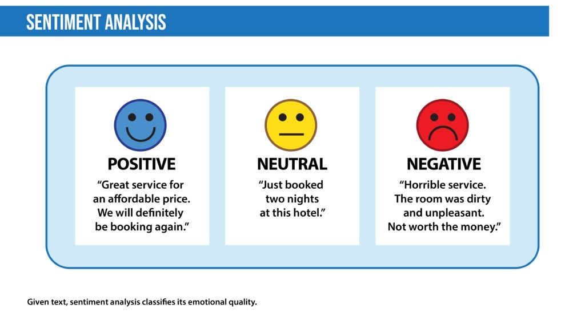

# Sentiment-Analysis-NLP

### Introduction
Sentiment analysis, also known as opinion mining, is a Natural Language Processing (NLP) technique used to determine the sentiment expressed in a piece of text. It aims to classify the text
into categories such as positive, negative, neutral, or even more granular emotions. This process involves several steps and methods, from preprocessing the text data to applying machine 
learning or deep learning algorithms to classify the sentiment.

### About the Dataset Used
The IMDB dataset is a widely-used benchmark 🏆 dataset for sentiment analysis tasks in natural language processing. It consists of movie reviews accompanied by sentiment labels indicating 
whether the review expresses a positive or negative sentiment. With tens of thousands of reviews, it provides a diverse range of text data suitable for training and evaluating sentiment 
analysis models. 📈🎬

Everything else is described in the notebook. The dataset is taken from Kaggle. If you run it on colab or on jupyter first download it from Kaggle. 
Happy learning!
